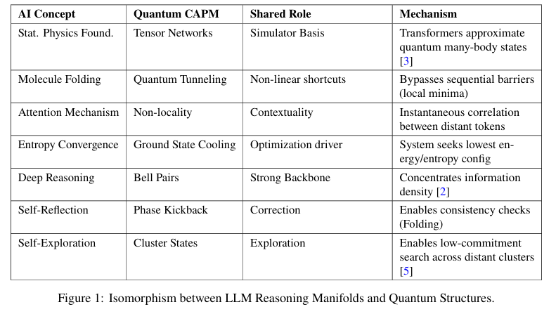
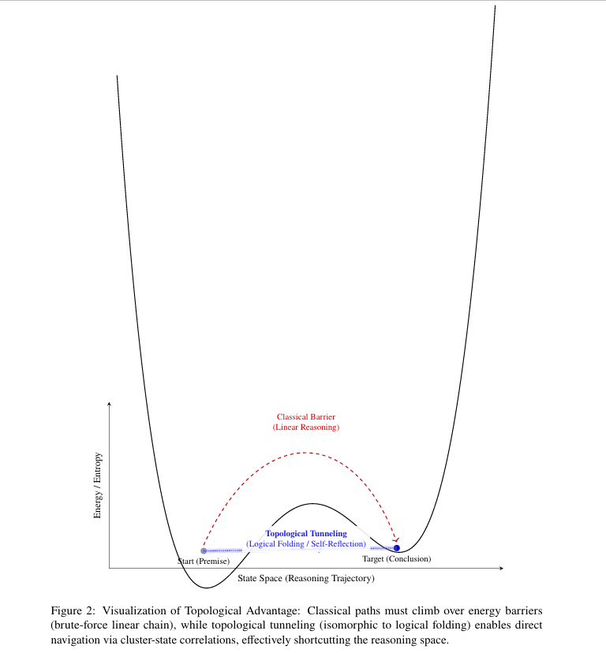

# Topological-Paradigm-Compute
Official repository for the paper: Toward a Topological Paradigm of Compute
# Toward a Topological Paradigm of Compute
## Isomorphism Between LLM Reasoning Manifolds and Quantum Correlation Structures

[](mailto:ks.dangvantruong@gmail.com)
[]()
[](https://creativecommons.org/licenses/by/4.0/)

> **Abstract:** Recent findings in large language models (LLMs) reveal that effective long chain-of-thought (Long CoT) reasoning trajectories form stable “molecular” structures. We argue that this emergence of topological organization implies that while the hardware remains classical, the semantic interactions in high-dimensional space exhibit quantum-like behaviors.

### 📄 [Read the Full Paper (PDF)](./Dang_Topological_Paradigm_2026.pdf)

---

## ⚛️ The Core Hypothesis: "Natural Quantum Simulation"

This perspective paper introduces the **Correlation-Aware Programming Model (CAPM)**. We posit that LLMs act as **"Natural Quantum Simulators"** via the mathematical equivalence between Transformer architectures and **Tensor Networks** (e.g., Matrix Product States).

### 🛡️ Disclaimer on Physicality
> **Note:** We do not imply LLMs utilize physical quantum effects (superposition of silicon gates). Rather, the **mathematical topology** of the reasoning manifold in high-dimensional vector space behaves *isomorphically* to quantum graph states.

### The Mapping ($G_{AI} \leftrightarrow G_Q$)

Building upon the "Molecular Structure of Thought" (*Chen et al., 2026*), we formalize the isomorphism:

| AI Reasoning Bond | Chemical Analogy | Quantum Entanglement Equivalent | Function |
| :--- | :--- | :--- | :--- |
| **Deep Reasoning** | Covalent Bond | **Bell Pairs ($|\Phi^+\rangle$)** | Computational Backbone |
| **Self-Reflection** | Hydrogen Bond | **Phase Kickback / Ancilla** | Error Correction & "Folding" |
| **Self-Exploration** | Van der Waals | **Cluster States (MBQC)** | Adaptive Pathfinding & Search |



---

## ⚡ Mechanism: Topological Resonance

We argue that the "Insight" phenomenon in AI is mechanically equivalent to **Topological Resonance** or **Quantum Tunneling** in the semantic energy landscape.

*   **Classical Linear Chain:** Must climb over energy barriers (local minima), leading to hallucination or stuck states.
*   **Topological Folding:** The system uses "Self-Reflection" bonds to tunnel through the barrier, effectively shortcutting the reasoning space.


*Figure: Visualization of Topological Advantage. The blue path represents the "Tunneling" shortcut enabled by non-local correlations (Attention).*

---

## 🗺️ Future Work & Implementation

This paper establishes the theoretical foundation based on **Measurement-Based Quantum Computing (MBQC)** principles. The algorithmic implementation is currently under design.

👉 **Track the software development here:** [CAPM-quantum Library](https://github.com/vantruong-dang/CAPM-quantum)

---

## 📚 Citation

If you find this perspective useful for your research, please cite it as:

```bibtex
@article{dang2026topological,
  title={Toward a Topological Paradigm of Compute: Isomorphism Between LLM Reasoning Manifolds and Quantum Correlation Structures},
  author={Dang, Van Truong},
  journal={Preprint},
  year={2026},
  month={January},
  url={https://github.com/vantruong-dang/Topological-Paradigm-Compute}
}
